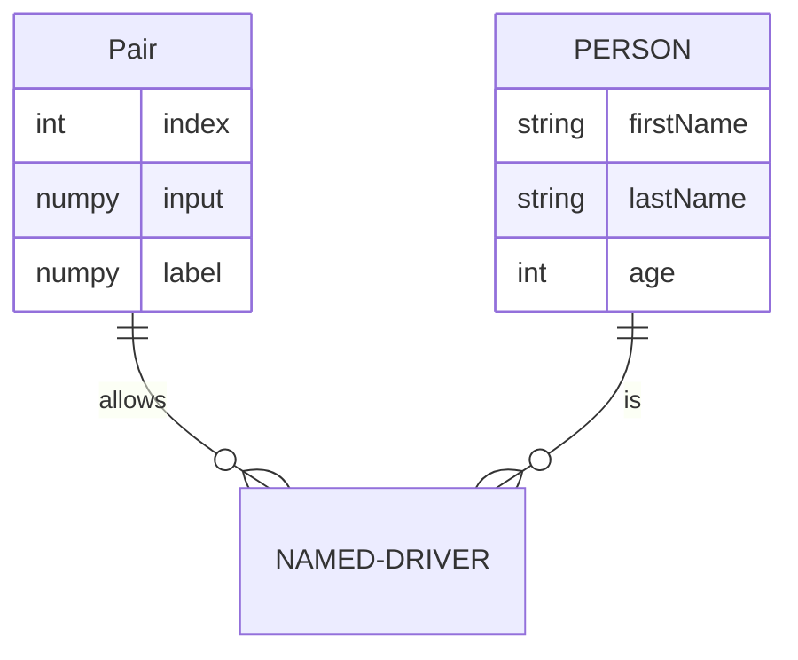

```mermaid
erDiagram
    Pair ||--o{ NAMED-DRIVER : allows
    Pair {
        int index
        numpy input
        numpy label
    }
    PERSON ||--o{ NAMED-DRIVER : is
    PERSON {
        string firstName
        string lastName
        int age
    }
```